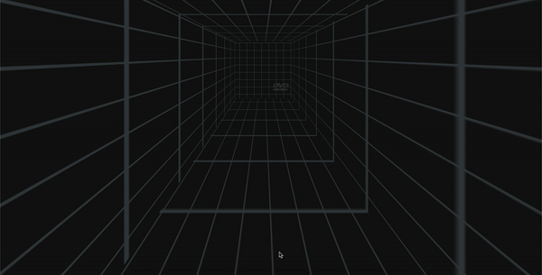

# Quantori Homework #2

### HTML & CSS

---

**Main branch:** <a href="https://mordvintsevmv.github.io/quantori_homework_2" target="_blank">Open page</a>

**Description:** *The main branch of the app.*

---

**2D Screensaver Static:** <a href="https://quantori-hw2-feature-2d-screensaver.netlify.app" target="_blank">Open page</a>

**Description:** *Classic DVD logo animation using pure HTML/CSS*

---

**2D Screensaver JS:** <a href="https://quantori-hw2-feature-2d-screen-js.netlify.app/" target="_blank">Open page</a>

**Description:** *Classic DVD logo animation using CSS animation and the ability to dynamically create new logos with JS*

---

**3D Screensaver:** <a href="https://quantori-hw2-feature-3d-screensaver.netlify.app/" target="_blank">Open page</a>

**Description:** *Classic DVD logo animation in 3D*

---

## <a name="content">Content</a>

1. [Sound Warning](#sound-warning)
2. [Task](#Task)
3. [Technical solutions](#solutions)
   1. [2D movement](#solutions-2d-movement)
   2. [Color Change on pure CSS](#solutions-color-css)
   3. [Laser sound on bounce without JS](#solutions-laser-html)
   4. [Color Change on JS](#solutions-color-js)
   5. [Multiple logos on JS](#solutions-multiple-js)
   6. [3D movement](#solutions-3d-movement)
4. [Branches](#branches)
   1. [2D static](#branches-2d-static)
   2. [2D JavaScript](#branches-2d-js)
   3. [3D](#branches-3d)
5. [Contacts](#contacts)

---

## <a name="sound-warning">Sound Warning</a>

Most browsers block autoplay of audio. 
For this reason, different versions of the site may reproduce (or not) the sound of the laser differently. 
Below are examples of problems and ways to solve them.

### Safari 

Often, you can enable sound in the Safari browser by using:

1. Right-click on the tab
2. Settings for...
3. Auto-Play -> Allow all autorun

However, this does not work on iOS and sometimes works poorly in the desktop version of the browser.

### Chrome and etc

The 2D static version of the site will never play sound in the Chrome browser. 
This is due to the rules of autoplay, which do not allow sound from the *audio* tag to play if the user has not turned it on himself.

This problem was solved in the 2D JS version, where a script is used to play audio.

In order for the browser to allow audio playback with JS, the user needs to interact with the site in some way. 
The easiest option is to click on any place on the screen. 
A message with a suggestion to do this will be displayed to all users.

**Thus, to test the sound in the 2D static version, it is best to use Safari, and in other versions - Chrome.**

---

## <a name="Task">Task</a>

Create an animation using HTML and CSS that reproduces the "screensaver" effect 
of an old DVD player, where a logo smoothly moves across the screen, 
bounces off the edge, and changes color.

- [X] The animation should repeat infinitely and be synchronized with a sound effect.
- [X] The animation should start with the appearance of the logo, which begins to move smoothly across the screen along a horizontal or vertical axis. When the logo reaches the edge of the screen, it should bounce off it, changing color, for example, to white.
- [X] It is important that the animation is synchronized with a sound effect that imitates the sound of a laser hitting the corner of the screen when the logo bounces off the edge.
- [X] To make the animation look as realistic as possible, it is recommended to use CSS properties such as transform, transition, animation, and keyframes. Also, make sure that the animation displays correctly in all modern web browsers.

**Extra task #1**
- [X] Instead of one logo, add two or three logos that move across the screen in different directions and frequencies.

**Extra task #2**
- [X] Implement a 3D animation using CSS transitions and perspective. For example, the logos can move along a 3D surface and reflect on mirrored walls.

---

## <a name="solutions">Technical Solutions</a>

Here are the main technical solutions that were used in the development.

Since the task required to implement all animations using pure HTML and CSS, it was often necessary to use tricks.

The 2D Static branch contains pure animation without JS. 
In other branches, JS was used primarily to quickly generate animation delays or DVD Logo colors.
So technically, all animations are implemented using CSS, and JS was used to speed up development.

### <a name="solutions-2d-movement">2D movement</a>

Two @Keyframes were created for movement - horizontally and vertically - from the beginning to the edge.

```scss
// Horizontal movement
@keyframes dvd-bounce-horizontal {
  0% {
    left: 0;
  }
  100% {
    left: calc(100vw - $dvd-width);
  }
}
```

*dvd-screensaver.scss - horizontal movement*

Next, this Keyframes were added to the logo image as animation with different duration:

```scss
.dvd-logo {
[...]
animation: 
  dvd-bounce-horizontal 3.5s linear 0s infinite alternate,
  dvd-bounce-vertical 2s linear 0s infinite alternate;
[...]
```

*dvd-screensaver.scss - applying animation*

This allowed the logo to move along two axes independently of each other.

Various speeds have also been added for screen orientation, animations for webkit, and so on.

### <a name="solutions-color-css">Color Change on pure CSS</a>

The only possible option to change the color of the black png in pure CSS is to use filter.

To speed up the work, a lot of colors were saved in CSS variables:

```scss
:root {
  --red: invert(46%) sepia(61%) saturate(4458%) hue-rotate(337deg) brightness(96%) contrast(96%);
  --pink: invert(30%) sepia(61%) saturate(1813%) hue-rotate(307deg) brightness(91%) contrast(95%);
[...]
```

*dvd-screensaver.scss - color variables*

To change colors, a Keyframe with 16 sections was created:

```scss
@keyframes dvd-color-vertical {
  6.25%{
    filter: var(--blue);
  }
  12.5% {
    filter: var(--pink);
  }
[...]
```

*dvd-screensaver.scss - color keyframe*

In order for the color not to flow smoothly, but to change instantly, it was decided to use the steps time function:

```scss
    animation: ... dvd-color-vertical 32s step-start 0s infinite;

```

*dvd-screensaver.scss - color animation*

Now there is a problem - you can use only one animation with steps(). 
If you try to use several similar animations, only the last one will be used.

To solve the problem, the dvd logo image was wrapped with a div element in HTML.
Since it is located on top of the image, we cannot change its color using ready-made filters (they will overlap each other and give dim colors).

The simplest solution is to invert the wrapper by 100% for each bounce on a different axis - then we are guaranteed to get a different color.

```scss
@keyframes dvd-bounce-horizontal {
  0% {
    left: 0;
  }
  100% {
    left: calc(100vw - $dvd-width);
  }
}
```

*dvd-screensaver.scss - color keyframe*

Applying animation to the wrapper:

```scss
.dvd-wrapper {
  [...]
  animation: dvd-color-horizontal 7s steps(2, jump-both) 0s infinite;
}
```

*dvd-screensaver.scss - color animation*

Now the colors successfully change with each impact on any edge!

### <a name="solutions-laser-html">Laser sound on bounce without JS</a>

Since we need to implement laser sound without JS, we had to use some tricks.

2 audio tracks were created from the original file:
1. laser-delay2
2. laser-delay35

They were created with a delay that takes into account the animation time. 
The tracks were adjusted in milliseconds to play the sound exactly at the moment of impact.

Of course, it didn't work out perfectly and over time the sound begins to lag behind the bounce. 
However, this option allows you to get the desired result with high accuracy without JS.

All other versions of the site use JS for more accurate sound reproduction.

### <a name="solutions-color-js">Color Change on JS</a>

Using JS, it was possible to significantly speed up the process of creating new colors for the logo.

A function was created that randomly generates each CSS filter property:

```javascript
const createRandomFilter = () => {
    return `
        invert(${Math.floor(Math.random() * 100)}%) 
        sepia(${Math.floor(Math.random() * 100)}%) 
        saturate(${Math.floor(Math.random() * 10000)}%) 
        hue-rotate(${Math.floor(Math.random() * 360)}deg) 
        brightness(${Math.floor(Math.random() * 100)}%) 
        contrast(${Math.floor(Math.random() * 100)}%)`
}
```

*multiple-dvd.js - color function*

This approach allows you not to limit yourself to a few colors, but to create new ones every time. 
However, dark colors can often be generated that blend into the background. 
This is planned to be fixed in the future.

### <a name="solutions-multiple-js">Multiple logos on JS</a>

It was decided to implement the ability to display multiple logos using JS.

The user can add and remove dvd logos using the + and - buttons on the display.
A unique start position, animation speed and color are generated for each logo.
Each logo makes a sound when it hits the edge of the screen.

Note, that all motion animations and color changes are also implemented by CSS Keyframes and animations. 
JS used only to dynamically create new elements and assign them the required values.

For example, adding animation function for new logo:
```javascript
// Function for creating random animation speed and delay with CSS animations
const createRandomAnimation = () => {
    let delay = 30 * Math.floor(Math.random() * 10);

    let speedX = Math.floor(Math.random() * 10)
    let speedY = Math.floor(Math.random() * 10)

    return `dvd-bounce-horizontal ${speedX}s linear -${delay}s infinite alternate,
         dvd-bounce-vertical ${speedY}s linear -${delay}s infinite alternate`
}
```

*multiple-dvd.js - animation function*


### <a name="solutions-3d-movement">3D movement</a>

To move 3D objects in CSS - transform: translateZ() translateX() translateY().

However, we cannot create 3 Keyframes with transform: translateX/Y/Z() for each axis, as they will overwrite each other. 
As a result, the object will move only on one axis.

Thus, it is necessary to use a trick:

**1 Keyframe:** We move the object using transform along the Z axis and fix the necessary coordinates (statically) along the X and Y axes:

```scss
@keyframes dvd-bounce-z {
    from {
        transform: translateZ(-30px) translateX(50px) translateY(-30px);
    }
    to {
        transform: translateZ(150px) translateX(50px) translateY(-30px);
    }
}
```

*dvd-logo.css - Z axis bounce*

**2 and 3 Keyframe:** Using the standard top and left to move the object along the X and Y axes:

```scss
@keyframes dvd-bounce-x {
  from {
    top: 130px;
  }
  to {
    top: 300px;
  }
}
```

*dvd-logo.css - X axis bounce*

All coordinates were pre-selected so that the logo did not go beyond the boundaries of the cube.

---

## <a name="branches">Branches</a>

### <a name="branches-2d-static">2D Static</a>

**Description:** *Classic DVD logo animation using pure HTML/CSS*


### <a name="branches-2d-js">2D JavaScript</a>

**Description:** *Classic DVD logo animation using CSS animation and the ability to dynamically create new logos with JS*


### <a name="branches-3d">3D</a>

**Description:** *Classic DVD logo animation in 3D*



---

## <a name="contacts">Contacts</a>

**TG**: [@mordvintsevmv](https://t.me/mordvintsevmv)

**e-mail**: mordvintsevmv@gmail.com


[🔝Content🔝](#content)
